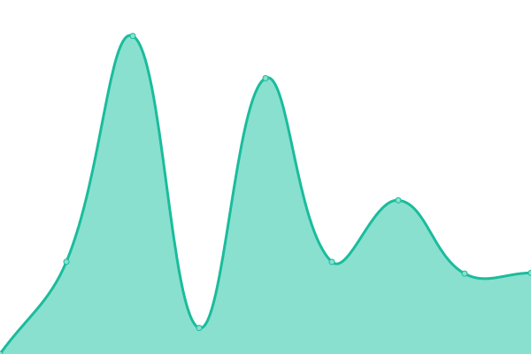

# [📈 Live Status](https://status.abstract-hosting.com): <!--live status--> **🟩 All systems operational**

This repository contains the open-source uptime monitor and status page for [Keenan](https://status.abstract-hosting.com), powered by [Upptime](https://github.com/upptime/upptime).

With [Upptime](https://upptime.js.org), you can get your own unlimited and free uptime monitor and status page, powered entirely by a GitHub repository. We use [Issues](https://github.com/BeeSting50/Abstract-Status/issues) as incident reports, [Actions](https://github.com/BeeSting50/Abstract-Status/actions) as uptime monitors, and [Pages](https://status.abstract-hosting.com) for the status page.

<!--start: status pages-->
<!-- This summary is generated by Upptime (https://github.com/upptime/upptime) -->
<!-- Do not edit this manually, your changes will be overwritten -->
<!-- prettier-ignore -->
| URL | Status | History | Response Time | Uptime |
| --- | ------ | ------- | ------------- | ------ |
|  [🠠Home](https://www.abstract-hosting.com) | 🟩 Up | [home.yml](https://github.com/BeeSting50/Abstract-Status/commits/HEAD/history/home.yml) | 

 937ms
     
 | 

<a href="https://status.abstract-hosting.com/history/home">100.00%</a>
    

|  [🧾 Billing](https://billing.abstract-hosting.com) | 🟩 Up | [billing.yml](https://github.com/BeeSting50/Abstract-Status/commits/HEAD/history/billing.yml) | 

 2410ms
     
 | 

<a href="https://status.abstract-hosting.com/history/billing">100.00%</a>
    

|  [💻 c1](https://c1.my-control-panel.com) | 🟩 Up | [c1.yml](https://github.com/BeeSting50/Abstract-Status/commits/HEAD/history/c1.yml) | 

 2416ms
     
 | 

<a href="https://status.abstract-hosting.com/history/c1">100.00%</a>
    

|  [🎛️ Game Panel](panel.abstract-hosting.com) | 🟩 Up | [game-panel.yml](https://github.com/BeeSting50/Abstract-Status/commits/HEAD/history/game-panel.yml) | 

 824ms
     
 | 

<a href="https://status.abstract-hosting.com/history/game-panel">100.00%</a>
    

<!--end: status pages-->

[**Visit our status website →**](https://status.abstract-hosting.com)

## 📄 License

- Powered by: [Upptime](https://github.com/upptime/upptime)
- Code: [MIT](./LICENSE) © [Anand Chowdhary](https://anandchowdhary.com), supported by [Pabio](https://pabio.com)
- Data in the `./history` directory: [Open Database License](https://opendatacommons.org/licenses/odbl/1-0/)
